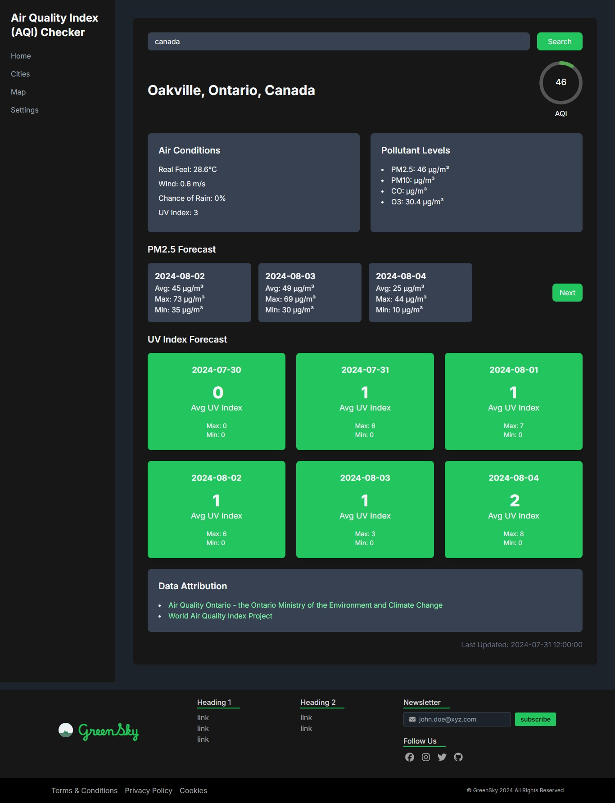

# React + Vite

This template provides a minimal setup to get React working in Vite with HMR and some ESLint rules.

Currently, two official plugins are available:

- [@vitejs/plugin-react](https://github.com/vitejs/vite-plugin-react/blob/main/packages/plugin-react/README.md) uses [Babel](https://babeljs.io/) for Fast Refresh
- [@vitejs/plugin-react-swc](https://github.com/vitejs/vite-plugin-react-swc) uses [SWC](https://swc.rs/) for Fast Refresh

## Steps to Setup

### 1. Initialize the Project:

```sh
npm create vite@latest my-react-app --template react
cd my-react-app
```

### 2. Install Dependencies:

```sh
npm install
```

### 3. Extra modules:

```sh
npm install daisyui
npm install react-circular-progressbar
```

### 4. Run the Project:

```sh
npm run dev
```

## Current UI

### Screenshot:

